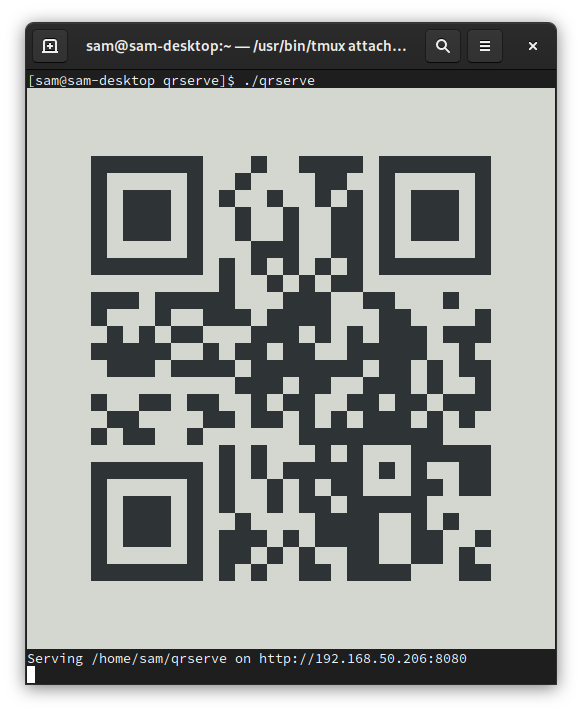

# An HTTP server that shows its URL as a QR code

This is a simple tool that I hacked together to transfer files from my computer
to my phone. It's possible to use cloud services like Dropbox or iCloud for
this, but for my particular use case, this is a little more streamlined.

It's similar to `python3 -m http.server`, except that it also prints a QR code
to standard output, which you can then scan with your phone. So there's no need
to manually type in the server's address.



## Installation

[Install Go](https://golang.org/doc/install) and run the following command:

```
$ go get -v github.com/samuong/qrserve
```

You'll then have a `qrserve` binary under `$GOPATH/bin`.

If you haven't set `$GOPATH` yourself, then it'll probably be under
`$HOME/go/bin` (or `%USERPROFILE%\go\bin` on Windows). See
<https://golang.org/cmd/go/#hdr-GOPATH_environment_variable> if you're
interested in the details.

## Usage

By default, `qrserve` will serve the current working directory (using
`net/http`'s [FileServer](https://pkg.go.dev/net/http#FileServer)) over port
8080. An alternative directory (or file) can be specified as an argument.
